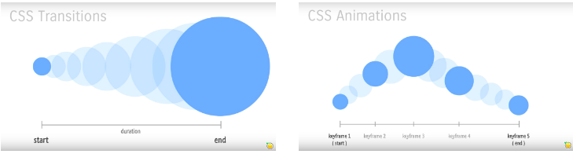

# CSS Animations & Transitions

## Table of contents

- [General info](#general-info)
- [Structure de la présentation](#structure-de-la-présentation)
- [Technologies](#technologies)
- [Setup](#setup)
- [Status](#status)
- [Contact](#contact)

## General info

Ce workshop convient parfaitement aux débutants car les techniques de transitions et d'animations seront présentées depuis le point 0.

Il conviendra également aux personnes avec un niveau plus avancé afin de leur permettre d'entreprendre une révision détaillée.

## Structure de la présentation

1. Transitions vs Animations
2. Partie **animation** + exercices (_optionnel_)
3. Partie **transition** + exercices (_optionnel_)
4. Partie **transition on scroll** + exercices (_recommandé_)

## Technologies

- HTML5
- CSS3
- Vanilla Javascript

## Setup

To run this project, install it locally using npm:

- Clone this repository
  \$ git clone https://github.com/ewelina-slepko/Pure-CSS-Animation

- Go into the repository
  \$ cd Pure-CSS-Animation

- Install dependencies
  \$ npm install

- Run the app
  \$ npm start

## Status

Project is: _in progress_.

## Contact

Created by Donovan Herion (donovanherion@gmail.com) - feel free to contact me!
